# Cybersickness Roller Coaster Experiment

This Unity project is one of two experiments featured in *Field Dependence as a Predictor of Cybersickness Dropout*. The goal of this experiment is to induce cybersickness in participants through a disorienting virtual reality (VR) roller coaster experience. 

Participants are given short instructions, then placed on a brief roller coaster ride (~2 minutes) through a 3D medieval desert city environment with an invisible roller coaster track. Green "balloons" are placed at random locations along the roller coaster track to ensure participants keep their eyes open and remain attentive. Participants can pop these balloons by focusing on them for a short duration, and the ratio of balloons popped to balloons spawned is recorded at the end of their roller coaster ride.

Upon completing the roller coaster experience, participants' balance is measured using their moment of inertia. They also complete a within VR survey based on the Virtual Reality Sickness Questionnaire (VRSQ) to self-report their level of sickness on a four-point Likert scale. Survey responses, moment of inertia, balloon popping ratio, session, level, and a unique user identifier, are submitted to Qualtrics.

Participants repeat this cycle for a predetermined number of levels within the experiment session. If a participant feels too sick to continue at any point, the session ends, and no further data is collected. Additionally, if their average survey response at any level exceeds a specific score threshold, the session will automatically conclude.

## Running the Experiment

You can run the experiment within the editor or via build.

**Note:** To record experiment data, make sure that `cybersickness.json` is located in the `Assets/` folder when running from the Unity editor, or in the game data folder when running a built version of the project. `cybersickness.json` must be edited by the experimenter beforehand to contain a unique identifier PID string for the participant and a session number integer. This is for tracking participant information submitted to the qualtrics survey across multiple levels and sessions.

Example `cybersickness.json`:
```json
{
  "pid": "1",
  "session": 1
}
```

### Building the Experiment
To build the experiment:

1. Open **File > Build Settings**.
2. Add the following scenes to the build:  
   - `Start_Scene`  
   - `Experiment_Scene`  
   - `Exit_Scene`  
   - `No_Internet_Scene`
3. Set the target platform to **Windows**.
4. Click **Build** to create the executable.

## Project Structure

### Scenes

- `Start_Scene` - Initial scene for the participant with instructions.
- `Experiment_Scene` - The roller coaster test, balance measuring, and within VR survey.
- `End_Scene` - Final scene prompting participant exit.
- `No_Internet_Scene` - The start scene redirects you here if there is no internet connection. 

### Important Components

Source code is found in the `Source/` directory, with the exception of [`TrackSplineInspector.cs`](Assets/Editor/TrackSplineInspector.cs) in the `Editor/` directory, which is for the custom editor used to create new roller coaster tracks.  

- [`ExperimentController.cs`](Assets/Source/Experiment/ExperimentController.cs)  
State machine component for managing the experiment. Handles running the roller coaster test, balance measurement, survey, and sending data to Qualtrics.

- [`RollerCoasterTest.cs`](Assets/Source/Experiment/RollerCoasterTest.cs)  
  State machine component for managing roller coaster test sessions.

  - [`RollerCoaster.cs`](Assets/Source/Experiment/RollerCoaster.cs)  
    Component for a roller coaster that moves along a Track.

  - [`TrackSpline.cs`](Assets/Source/Experiment/TrackSpline.cs)  
    Represents a spline consisting of connected Bezier curves. Responsible for creating and editing the spline, and for calculating the position, direction, and rotation of the spline at a given point.

  - [`Track.cs`](Assets/Source/Experiment/Track.cs)  
    Scriptable object for storing coaster track data.

- [`MeasureBalance.cs`](Assets/Source/Experiment/MeasureBalance.cs)  
  State machine component for measuring user balance after a roller coaster test.

- [`Survey.cs`](Assets/Source/Experiment/Survey.cs)  
  Manages a VR survey system with a 4-point Likert scale for measuring user responses. Handles survey state management, UI interactions, and result processing.

## Building a Track
A roller coaster track is a spline made of connected Bezier curves. Each Bezier curve is made of four spline point objects: two anchor points (start and end) and two control points that determine the curve's shape.

To build your own track, add a Track Spline component to a game object.

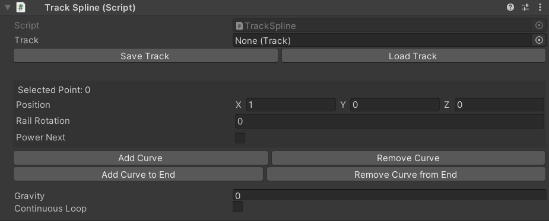

### Position Points
Points can be positioned either by using the fields in the inspector or by selecting the point (left click) in the scene view and using the move tool handle.

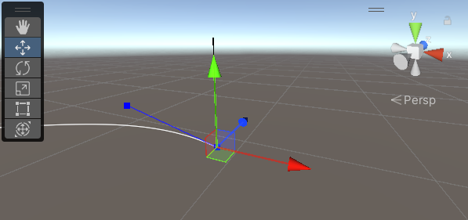

### Rotate Points
Points only have a single axis of the rotation around the track. The black line attached to curve anchor points is used to indicate the rail rotation. This rotation represents the coaster vertical direction when it is at this point in the track. The rail rotation is interpolated between anchor points.

Anchor points can be rotated either by using the rail rotation field in the inspector or by selecting the anchor point in the scene view and using the rotate tool handle.

**Note:** Control points cannot be rotated as they don't lie upon the curve, only influence the curve position.

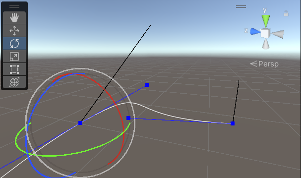

Choose local space for the tool handle rotation for ease of rotating the anchor point in the scene view.

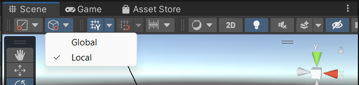

### Powered Rails
Curves can be powered, meaning that section of curve along the track spline will ignore the effects of gravity and accelerate the coaster to a target speed by the end of the powered section of curve.

Powered sections are red, whereas gravity affected sections are white.

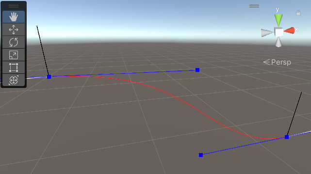

Selecting an anchor point gives the options to power the next curve where that anchor point is the start point, or power the previous curve where that anchor point is the end point.

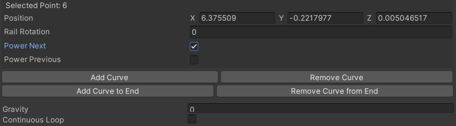

Selecting a control point gives the option to power the curve the control point belongs to.

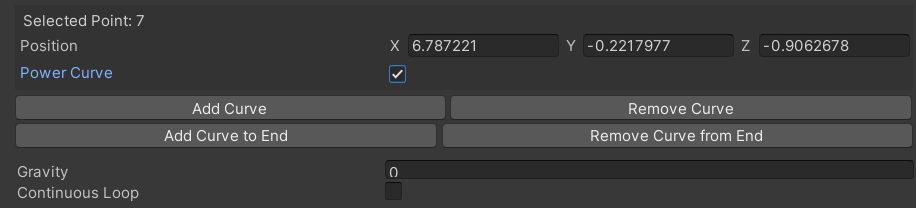

Selecting the anchor point at the end of a powered section of curves reveals the speed field, which is the desired speed of the coaster at the end of the powered section. If multiple adjacent curves are powered, the speed field will only be available to the anchor point end of the last powered curve in the section.

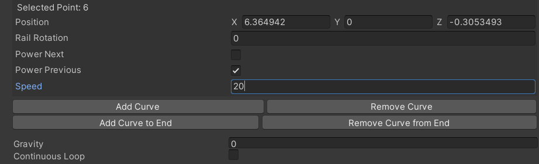

### Add Curve
The "Add Curve" button will add a new curve by splitting the next curve if an anchor point is selected, or if a control point is selected it will split the curve that control point belongs to.

The "Add Curve to End" button will ignore the currently selected point and add a new curve to the end of the spline.

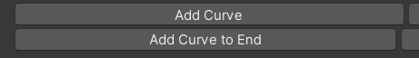

### Remove Curve
The "Remove Curve" button will delete the curve associated with the currently selected anchor or control point. 

The "Remove Curve from End" button will ignore the currently selected point and delete the curve at the end of the spline.

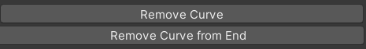

### Gravity
Set the gravity the coaster will experience along the track at unpowered rail sections.

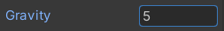

### Is Continuous Loop
Determines if the start and end points of the spline are connected.

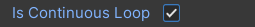

### Loops
Specifies how many times the coaster will complete the track loop in a level. Minimum value is 0.

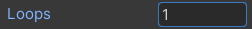

**Note:** The loop field will only be exposed to the inspector if `isContinuousLoop = true`.


### Saving/Loading Tracks

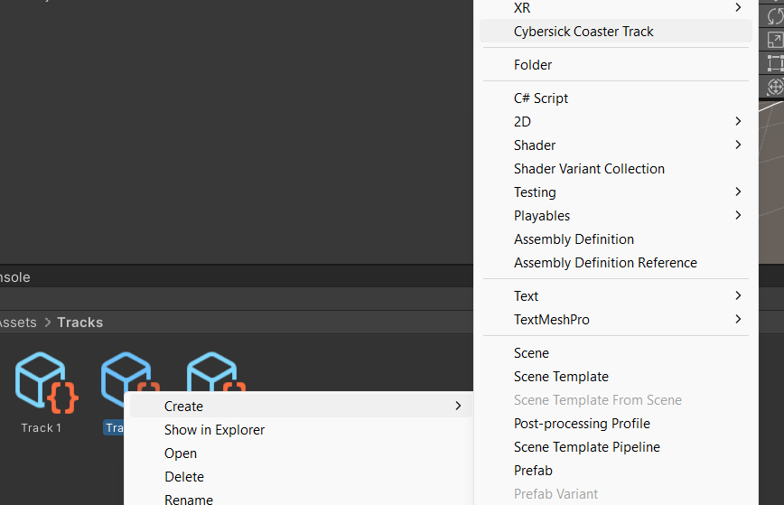

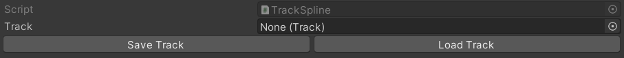

To Save a Track:
1. In the Project tab, right click.
2. Click **Create > Cybersick Coaster Track**.
3. Drag your track scriptable object into the **Track** field.
4. Click the **Save** button.

To Load a Track
1. In the Project tab, drag your saved track scriptable object into the **Track** field.
2. Click the **Load** button.

## Survey API Format
This application expects to make a POST request with the following query parameters:

| Parameter | Type | Description |
|---|---|---|
| `pid` | string | Participant ID |
| `session` | integer | Experiment session number for the user |
| `level` | integer | Level number within a single session |
| `balloon popped ratio` | string | Balloons popped to balloons spawned ratio |
| `moment of inertia` | string | Balance measurement |
| `general discomfort` | string | Survey response |
| `fatigue` | string | Survey response |
| `eyestrain` | string | Survey response |
| `difficulty focusing` | string | Survey response |
| `headache` | string | Survey response |
| `fullness of head` | string | Survey response |
| `blurred vision` | string | Survey response |
| `dizzy` | string | Survey response |
| `vertigo` | string | Survey response |
| `running time` | string | Time elapsed at the end of the latest roller coaster ride |

The API endpoint must be added to the `Survey URL` field in the `Experiment Controller` component in `Experiment_Scene`.